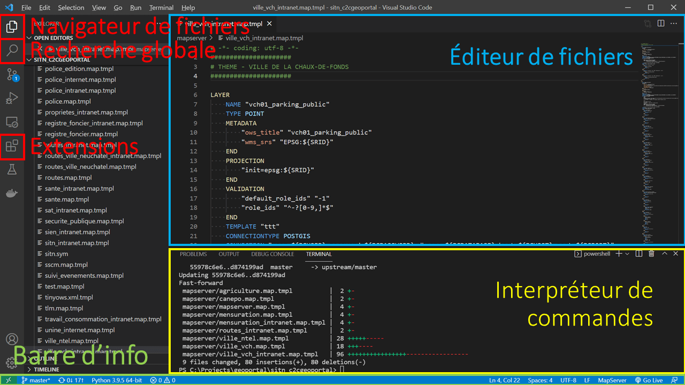

# Introduction

But de ce cours:

* Revoir les bases HTML et CSS
* Introduction à Visual Studio Code
* Présentation de Bootstrap, le framework HTML + CSS le plus populaire

---

## Comment suivre ce cours?

Prérequis:

* Un éditeur de texte (Visual Studio Code, Notepad++, etc.)
* Un navigateur (Firefox, Chrome, Edge)

---

class: center

## Les trois pilliers du web


Les données avec HTML 


Le style avec CSS


La logique avec JavaScript 

---

# HTML

Voici un exemple de fichier HTML minimal valide capable d'être lu par un navigateur:

```html
<!DOCTYPE html>
<html lang="fr">
  <head>
    <title>Titre</title>
  </head>
  <body>
  </body>
</html>
```

Exercice: copier-coller cet exemple dans un fichier nommé `index.html` et l'ouvrir avec un navigateur

---

# Visual Studio Code

* Recommandé pour ce cours mais pas obligatoire

* Plus qu'un éditeur de texte, c'est un éditeur de code (Emmet, JSLint, etc.)

* Orienté projet: on ouvre un dossier et pas seulement un fichier

* Extensible: Live Server 

---



---

## HTML - terminologie

Nous pouvons ajouter des commentaires dans un fichier HTML à l'aide de `<!-- blablabla -->`

```html
<!DOCTYPE html> <!-- Déclaration que c'est un document HTML -->
<html lang="fr"> <!-- `<html>` est une balise ou un tag, `lang` est un attribut, `"fr"` une valeur-->
  <head> <!-- la balise `<head>` contient les métadonnées de la page -->
    <title>Titre</title><!-- ce titre se retrouve dans le titre de l'onglet du navigateur -->
  </head><!-- la balise `<head>` doit être fermée -->
  <body><!-- le corps du document sera à l'intérieur des balises body -->
  </body>
</html>
```

* Toutes les balises n'exigent pas à d'être fermées

* Le HTML est un language à indentation facultative mais recommandée

---

## HTML - Quelques tags les plus utilisés

| Balise                | Description                                                 |
| ----------------------| ----------------------------------------------------------  |
| `<h1>` - `<h6>`       | Titre                                                       |
| `<p>`                 | Paragraphe                                                  |
| `<a href="url">`      | Lien (anchor ⚓)                                            |
| `<br>`                | Retour à la ligne (line **br**eak), pas besoin de le fermer |
| `<ul>` et `<li>`      | Liste à puces, **U**nordered **l**ist et **l**ist **i**tem  |
| `` | Image, pas besoin de le fermer, `alt="Description"`         |
| `<div>`               | Division de la donnée, pas de valeur syntaxique             |

Liste complète: https://www.w3schools.com/tags/

Exercice: utiliser ces tags dans le fichier précédemment créé


---

## HTML - Formulaires

<table>
  <tr>
    <td>
      <form>
        <label for="fname">Nom:</label><br>
        <input type="text" id="fname" name="fname" placeholder="Entrez votre nom"><br>
        <label for="lname">Prénom:</label><br>
        <input type="text" id="lname" name="lname" placeholder="Entrez votre prénom"><br>
        <label for="country">Pays:</label><br>
        <input type="text" id="country" name="country" value="Suisse"><br><br>
        <input type="button" value="Envoyer">
      </form>
    </td>
    <td>
      <pre><code class="html">&lt;form&gt;
  &lt;label for="fname"&gt;Nom:&lt;/label&gt;&lt;br&gt;
  &lt;input type="text" id="fname" name="fname" placeholder="Entrez votre nom"&gt;&lt;br&gt;
  &lt;label for="lname"&gt;Prénom:&lt;/label&gt;&lt;br&gt;
  &lt;input type="text" id="lname" name="lname" placeholder="Entrez votre prénom"&gt;&lt;br&gt;
  &lt;label for="country"&gt;Pays:&lt;/label&gt;&lt;br&gt;
  &lt;input type="text" id="country" name="country" value="Suisse"&gt;&lt;br&gt;&lt;br&gt;
  &lt;input type="button" value="Envoyer"&gt;
&lt;/form&gt;
</code></pre>
    </td>
  </tr>
</table>

---

## HTML - Tags de formulaires

* Texte court
```html
<input id="input1" name="input1" type="text">
```
<input id="input1" name="input1" type="text">

* Grand champ de saisie texte
```html
<textarea id="input2" name="input1" rows="4" cols="50"></textarea>
```
<textarea id="input2" name="input1" rows="4" cols="50"></textarea>

* Nombre
```html
<input id="input3" name="input3" type="number">
```
<input id="input3" name="input3" type="number">

---

* Date
```html
<input id="input4" name="input4" type="date">
```
<input id="input4" name="input4" type="date">

* Menu déroulant
```html
<select name="days" id="days">
  <option value="lundi">Lundi</option>
  <option value="mardi">Mardi</option>
  <option value="mercredi">Mercredi</option>
  <option value="jeudi">Jeudi</option>
</select>
```
<select name="days" id="days">
  <option value="lundi">Lundi</option>
  <option value="mardi">Mardi</option>
  <option value="mercredi">Mercredi</option>
  <option value="jeudi">Jeudi</option>
</select>

* Bouton
```html
<button id="clicker" type="button" onclick="faisQuelqueChose()">Ne cliquez pas, svp</button>
```
<button id="clicker" type="button" onclick="faisQuelqueChose()">Ne cliquez pas, svp</button>

<div id="clickerResult" hidden>Bravo, vous avez cliqué <span id="clickerCount">1</span> fois inutilement sur ce bouton!</div>

---

## HTML - Pas transcendant niveau design

On peut faire du style dans l'HTML,

```html
<h1 style="color:blue;text-align:center">Ceci est un titre</h1>
<br>
<p style="color:green">Et là un paragraphe</p>
<h1 style="color:blue;text-align:center">Ceci est un autre titre</h1>
<br>
<p style="color:green">Et là un autre paragrphe</p>
<br>
<br>
```

Mais:

* Pas DRY → **D**on't **R**epeat **Y**ourself, difficile à maintenir

* On doit écrire tous les styles dans l'attribut `style`, pas très lisible dans le code

* On mélange les rôles: l'HTML doit contenir les données de la page, pas ses styles

* On ne peut pas avoir plusieurs styles pour la même page

---

# CSS

Voici un exemple de CSS:

```css
body {
  font-family: Arial, Helvetica, sans-serif;
  background-color: lightblue;
}

h1 {
  color: white;
  text-align: center;
}
```

Conceptuellement nous avons un structure telle que:

```css
selecteur {
  propriete: valeur
}
```

---

## CSS - Où l'écrit-on?

1. Dans le `head` de l'HTML avec la balise `<style>`

```html
...
  <head> 
    <title>Titre</title>
    <style>
      .alert {
        color: red;
      }
    </style>
  </head>
...
```

2. Dans un ficher à par qu'on référence de le fichier HTML

2. Dans le body de l'HTML

---

Les sélecteurs

---

Les propriétés

Quelques exemples

---

CSS display

---

Unités

---

CSS Specificity

!important

---

Bootstrap

---