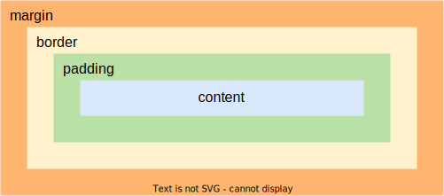
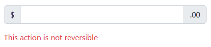
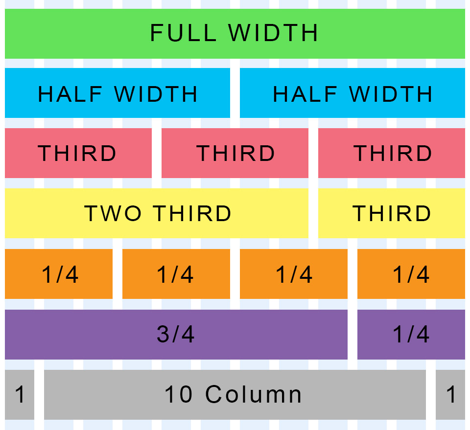
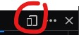

class: center middle

 

# Révision HTML et CSS

---

# Introduction

But de ce cours:

* Revoir les bases HTML et CSS

* Introduction à Visual Studio Code

* Présentation de Bootstrap, le framework HTML + CSS le plus populaire

## Comment suivre ce cours?

Prérequis:

* Un éditeur de texte (Visual Studio Code, Notepad++, etc.)

* Un navigateur (Firefox, Chrome, Edge)

---

class: center

## Les trois pilliers du web


Les données avec HTML 


Le style avec CSS


La logique avec JavaScript 

---

# HTML

Voici un exemple de fichier HTML minimal valide capable d'être lu par un navigateur:

```html
<!DOCTYPE html>
<html lang="fr">
  <head>
    <title>Titre</title>
  </head>
  <body>
  </body>
</html>
```

Exercice: copier-coller cet exemple dans un fichier nommé `index.html` et l'ouvrir avec un navigateur

On peut valider son HTML en ligne: https://validator.w3.org/#validate_by_input

---

# Visual Studio Code

* Recommandé pour ce cours mais pas obligatoire

* Plus qu'un éditeur de texte, c'est un éditeur de code (Emmet, JSLint, etc.)

* Orienté projet: on ouvre un dossier et pas seulement un fichier

* Extensible: Live Server 

---


---

## HTML - terminologie

Nous pouvons ajouter des commentaires dans un fichier HTML à l'aide de `<!-- blablabla -->`

```html
<!DOCTYPE html> <!-- Déclaration que c'est un document HTML -->
<html lang="fr"> <!-- `<html>` est une balise ou un tag, `lang` est un attribut, `"fr"` une valeur-->
  <head> <!-- la balise `<head>` contient les métadonnées de la page -->
    <title>Titre</title><!-- ce titre se retrouve dans le titre de l'onglet du navigateur -->
  </head><!-- la balise `<head>` doit être fermée -->
  <body><!-- le corps du document sera à l'intérieur des balises body -->
  </body>
</html>
```

* Toutes les balises n'exigent pas à d'être fermées

* Le HTML est un language à indentation facultative mais recommandée

---

## HTML - Quelques tags les plus utilisés

| Balise                | Description                                                 |
| --------------------- | ----------------------------------------------------------- |
| `<h1>` - `<h6>`       | Titre                                                       |
| `<p>`                 | Paragraphe                                                  |
| `<a href="url">`      | Lien (anchor ⚓)                                             |
| `<br>`                | Retour à la ligne (line **br**eak), pas besoin de le fermer |
| `<ul>` et `<li>`      | Liste à puces, **U**nordered **l**ist et **l**ist **i**tem  |
| `` | Image, pas besoin de le fermer, `alt="Description"`         |
| `<div>`               | Division de la donnée, pas de valeur syntaxique             |

Liste complète: https://www.w3schools.com/tags/

Exercice: utiliser ces tags dans le fichier précédemment créé


---

## HTML - Formulaires

<table>
  <tr>
    <td>
      <form>
        <label for="fname">Nom:</label><br>
        <input type="text" id="fname" name="fname" placeholder="Entrez votre nom"><br>
        <label for="lname">Prénom:</label><br>
        <input type="text" id="lname" name="lname" placeholder="Entrez votre prénom"><br>
        <label for="country">Pays:</label><br>
        <input type="text" id="country" name="country" value="Suisse"><br><br>
        <input type="button" value="Envoyer">
      </form>
    </td>
    <td>
      <pre><code class="html">&lt;form&gt;
  &lt;label for="fname"&gt;Nom:&lt;/label&gt;&lt;br&gt;
  &lt;input type="text" id="fname" name="fname" placeholder="Entrez votre nom"&gt;&lt;br&gt;
  &lt;label for="lname"&gt;Prénom:&lt;/label&gt;&lt;br&gt;
  &lt;input type="text" id="lname" name="lname" placeholder="Entrez votre prénom"&gt;&lt;br&gt;
  &lt;label for="country"&gt;Pays:&lt;/label&gt;&lt;br&gt;
  &lt;input type="text" id="country" name="country" value="Suisse"&gt;&lt;br&gt;&lt;br&gt;
  &lt;input type="button" value="Envoyer"&gt;
&lt;/form&gt;
</code></pre>
    </td>
  </tr>
</table>

* Les attributs `id` et `name` sont importants pour l'accès aux données.

* `placeholder` permet d'afficher une aide à la saisie mais n'est pas une valeur du formulaire

* `value` contient la valeur du formulaire, peut-être utilisé comme valeur par défaut.

---

## HTML - Tags de formulaires

#### Texte court

```html
<input id="input1" name="input1" type="text">
```

<input id="input1" name="input1" type="text">

#### Grand champ de saisie texte

```html
<textarea id="input2" name="input1" rows="2" cols="50"></textarea>
```

<textarea id="input2" name="input1" rows="2" cols="50"></textarea>

#### Nombre

```html
<input id="input3" name="input3" type="number">
```

<input id="input3" name="input3" type="number">

---

#### Date

```html
<input id="input4" name="input4" type="date">
```

<input id="input4" name="input4" type="date">

#### Menu déroulant

```html
<select name="days" id="days">
  <option value="lundi">Lundi</option>
  <option value="mardi">Mardi</option>
  <option value="mercredi">Mercredi</option>
  <option value="jeudi">Jeudi</option>
</select>
```
<select name="days" id="days">
  <option value="lundi">Lundi</option>
  <option value="mardi">Mardi</option>
  <option value="mercredi">Mercredi</option>
  <option value="jeudi">Jeudi</option>
</select>

#### Bouton

```html
<button id="clicker" type="button" onclick="faisQuelqueChose()">Ne cliquez pas, svp</button>
```
<button id="clicker" type="button" onclick="faisQuelqueChose()">Ne cliquez pas, svp</button> <div id="clickerResult" hidden>Bravo, vous avez cliqué <span id="clickerCount">0</span> fois inutilement sur ce bouton!</div>

---

## HTML - Pas transcendant niveau design

On peut faire du style dans l'HTML,

```html
<h1 style="color:blue;text-align:center">Ceci est un titre</h1>
<br>
<p style="color:green">Et là un paragraphe</p>
<h1 style="color:blue;text-align:center">Ceci est un autre titre</h1>
<br>
<p style="color:green">Et là un autre paragrphe</p>
<br>
<br>
```

Mais:

* Pas DRY → **D**on't **R**epeat **Y**ourself, difficile à maintenir

* On doit écrire tous les styles dans l'attribut `style`, pas très lisible dans le code

* On mélange les rôles: l'HTML doit contenir les données de la page, pas ses styles

* On ne peut pas avoir plusieurs styles pour la même page

---

# CSS

Voici un exemple de CSS:

```css
body {
  font-family: Arial, Helvetica, sans-serif;
  background-color: lightblue;
}

h1 {
  color: white;
  text-align: center;
}
```

Conceptuellement nous avons un structure telle que:

```css
selecteur {
  propriete: valeur;
}
```

---

## CSS - Où l'écrit-on?

#### 1. Dans le `head` de l'HTML avec la balise `<style>`

./index.html

```html
  ...
  <head> 
    <title>Titre</title>
    <style>
      .alert {
        color: red;
      }
    </style>
  </head>
    <body>
    <div class="alert">
      ...
```

---

#### 2. Dans un ficher à par qu'on référence dans le fichier HTML

./index.html

```html
  ...
  <head> 
    <title>Titre</title>
    <link rel="stylesheet" href="./mon-style.css">
  </head>
  <body>
    <div class="alert">
      ...
```

./mon-style.css

```css
.alert {
  color: red;
}
```

#### 3. Du `<style>` Dans le `<body>` de l'HTML?

Utilisé dans des cas particuliers (webcomponents). Sort du périmètre de ce cours.

---

## CSS - Les sélecteurs

Les sélecteurs les plus utilisés:

| Syntaxe        | Descritpion                                                |
| -------------- | ---------------------------------------------------------- |
| .nom-de-class  | Sélectionne tous les éléments ayant `class="nom-de-class"` |
| p              | Sélectionne tous les éléments `<p>`                        |
| #identifiant   | Sélection l'élément `id="identifiant"`                     |
| p.nom-de-class | Sélectionne tous les éléments `<p class="nom-de-class">`   |
| div, p         | Sélectionne tous les `<div>` et les `<p>`                  |

https://www.w3schools.com/cssref/css_selectors.asp

Exercice: Appliquer des styles de base en utilisant différents sélecteurs sur `./exemples/index.html`

---

## CSS - Display

Il y a deux types d'éléments au niveau de l'affichage:

* Des éléments de type `block`:
  - `<div>`
  - `<h1> - <h6>`
  - `<p>`
  - `<form>`
  - ...

* Des éléments de type `inline`:
  - `<span>`
  - `<a>`
  - ``

Exercice: Faites un style avec une bordure et appliquez le une fois sur un `<span>` et une fois sur un `<p>`.

Ces types d'affichage par défaut peuvent être changés avec la propriété `display`. On peut également cacher des éléments html à l'aide de `display: none;`

---

## CSS - Box

La position du contenu va être influencée par les marges, bordures et écarts de remplissage. La boîte de marges CSS est visible dans la console développeur de votre navigateur (F12).



---

## CSS - Unités les plus utilisées

| unité | type     | description                                                          |
| ----- | -------- | -------------------------------------------------------------------- |
| cm    | absolue  | centimètres, pour l'impression                                       |
| mm    | absolue  | milimètres, pour l'impression                                        |
| pt    | absolue  | points                                                               |
| px    | mixte    | pixel, dépend du support                                             |
| em    | relative | multiplicateur par rapport à la taille de police                     |
| rem   | relative | multiplicateur par rapport à la taille de police de l'élément racine |
| vh    | relative | 1% de la hauteur de la fenêtre                                       |
| vw    | relative | 1% de la largeur de la fenêtre                                       |
| %     | relative | par rapport à l'élément parent                                       |

---

## CSS - Specificité

Si deux sélecteurs css définissent un style différent pour un élément, la règle CSS ayant la plus haute spécifité sera appliquée.

| Sélecteur                  | valeur | Description   |
| -------------------------- | ------ | ------------- |
| p                          | 1      |               |
| .class                     | 10     |               |
| #id                        | 100    |               |
| `<p style="color: pink;">` | 1000   | à proscrire!  |
| p.class                    | 11     | 1 + 10        |
| p.class.class2             | 21     | 1 + 10 + 10   |
| p#class                    | 101    | 1 + 100       |
| #navbar p#demo             | 201    | 100 + 1 + 100 |


Le mot clé `!important` permet d'écraser toute spécifité et sera appliqué en dernier.

---

```css
p {
  color: blue;
  margin-top: 2em;
}

p.red {
  color: red !important;
}

#alert {
  color: blue;
}
```

```html
<p class="pink alert">
  <span id="alert">Attention:</span> Message Important<span style="color: yellow;">!</span>
</p>
```

Exercice: De quelle(s) couleur(s) sera le message?

NB: N'utilisez `!important` qu'en dernier recours, c'est une très mauvaise pratique de recourir à ce mot clé.

---

# Bootstrap


Bootstrap est un framework mettant à disposition une série de styles basés sur des éléments HTML et des classes. Le but de Bootstrap est:

* De faire économiser du temps aux développeurs

* De fournir une certaine consistance de style entre différentes pages

* d'être *responsive*: un seul html pour un navigateur de bureau, tablette ou smartphone

On peut dire que Bootstrap est finalement un grand fichier CSS à inclure dans votre projet.

---

## Bootstrap - comment l'utiliser?

#### Variante 1 - Utilisation du CDN

Pour inclure une librairie dans un projet, on peut utiliser un CDN (*Content Delivery Network*). Un **CDN** est un réseau de serveurs internet hébergeant des librairies JavaScript, des CSS ou des polices. Les CDN sont fiables et disposent d'une haute disponibilité:

```html
<head>
  <!-- CSS only -->
  <link href="https://cdn.jsdelivr.net/npm/bootstrap@5.2.1/dist/css/bootstrap.min.css" 
    rel="stylesheet"
    integrity="sha384-iYQeCzEYFbKjA/T2uDLTpkwGzCiq6soy8tYaI1GyVh/UjpbCx/TYkiZhlZB6+fzT"
    crossorigin="anonymous">
  ...

```

---

#### Variante 2 - Téléchargement

Vous pouvez également [télécharger ici](https://getbootstrap.com/docs/5.2/getting-started/download/) la dernière version de Bootstrap et l'inclure comme n'importe quel autre fichier css:

```html
<head>
  <link rel="stylesheet" href="css/bootstrap.min.css">
  ...
```

A noter que le zip contient plusieurs fichiers mais pour l'instant seul `bootstrap.min.css` est nécessaire

**Exercice**: Faire une copie du ficher exemples/index.html et y inclure Bootstrap selon la variante choisie.

---

### Bootstrap - Styles par défaut sur les éléments

La première chose que l'on constate lors de l'ajout de Bootstrap à notre projet, est la présence de styles par défaut sur les tags html de base (`<h1>`, `<p>`, etc.)


### Bootstrap - Documentation

Tout ce qui sera présenté ici peut-être retrouvé sur la documentation en ligne sur laquelle on peut également trouver de nombreuses implémentations concrètes:

https://getbootstrap.com/docs/

---

### Bootstrap - Attributs d'accessibilité

Il est courant de tomber sur des attributs tels que `aria-label` et `visually-hidden` dans la documentation de Bootstrap.

Ce sont des attributs d'aide à la lecture utilisés pour personnes en situation de handicap. ARIA signifiant: *Accessible Rich Internet Applications*.

```html
<div class="input-group mb-3">
  <span class="input-group-text">$</span>
  <input type="text" class="form-control" aria-label="Amount (to the nearest dollar)">
  <span class="input-group-text">.00</span>
</div>

<p class="text-danger">
  <span class="visually-hidden">Danger: </span>
  This action is not reversible
</p>
```



---

### Bootstrap - Mise en page

D'une manière générale, on met en page à l'aide d'éléments `<div>` car ces éléments n'ont pas de valeur syntaxique.

**Exercice**: Copier le fichier `exemples/index.html` et mettre le contenu de `<body>` dans un `<div>`

```html
...
<body>
  <div>
    <h1 class="titles">Titre 1</h1>
    <p>...
    ...
  </div>
</body>
</html>
```

**Exercice**: Sur ce `<div>`, ajouter la classe `container`.

**Exercice**: Sur ce `<div>`, remplacer la classe `container` par `container-fluid`.

Ces deux classes permettent de créer une marge agréable à la lecture, `container` fixe une largeur maximale que le contenu ne pourra pas dépasser.

---

### Bootstrap - Grille (*Grid* )

La grille Bootstrap offre une solution simple pour diviser l'espace disponible sur la largeur de l'écran. La grille est divisée en **12 colonnes**, peu importe la taille de l'écran.



---

Pour l'utiliser, il faut d'abord créer une **ligne** à l'aide d'un `<div class="row">`. Il est recommandé d'utiliser les grilles à l'intérieur d'un `container` ou d'un `container-fluid`.

Par exemple, toujours dans notre `index.html`, admettons que nous voulons les paragraphes en colonnes comme dans un journal. Commençons par mettre les trois paragraphes sur une ligne de la grille:

```html
  <div class="row">
    <h1 class="titles">Titre 1</h1>
    <p class="paragraph first-paragraph">
      ...
    </p>
    ...
  </div>
```

Ajoutons maintenant des colonnes `<div class="col">` à chaque paragraphe avec son titre:

```html
  <div class="row">
    <div class="col">
      <h1 class="titles">Titre 1</h1>
      <p class="paragraph first-paragraph">...
      </p>
    </div>
    <div class="col">
      <h1 class="titles">Titre 2</h1>
      <p class="paragraph first-paragraph">...
    etc..
```

---

Les paragraphes sont maintenant répartis sur trois colonnes dont la largeur est automatique.

Admettons que nous voulons maximum deux colonnes, nous pouvons demander à la colonne de prendre de 1 à 12 emplacements sur la grille.
Comme nous voulons deux colonnes sur toute la largeur de l'écran, une colonne devra mesurer **6** emplacements, remplaçons les classes `col` par `col-6`.

```html
  <div class="row">
    <div class="col-6">
      <h1 class="titles">Titre 1</h1>
      <p class="paragraph first-paragraph">...
      </p>
    </div>
    <div class="col-6">
      <h1 class="titles">Titre 2</h1>
      <p class="paragraph first-paragraph">...
    etc..
```

---

### Bootstrap - *Responsive*


Le rendu est pas mal sur un ordinateur de bureau, mais qu'en est-il sur mobile?

Dans la console développeur (F12), cliquer sur la vue mobile  (ou CTRL + MAJ + M) et redimensionner la fenêtre afin quelle corresponde à la taille d'un smartphone.

Les deux paragraphes côte à côte ne sont pas très agréables à cette taille d'écran, mais Bootstrap est *Responsive*. Remplacer les classes `col-6` par `col-sm-6` permet d'ajouter un point de rupture (*breakpoint*).

#### 

`col-sm-6` signifie: ce `<div>` sera une colonne de taille 6 depuis une largeur d'écran *small* (576px) en dessous, ce n'est plus une colonne.

Pour plus d'infos sur la grille et les points de rupture: https://getbootstrap.com/docs/5.2/layout/grid/

