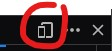

INSTALATION GO-LIVE


Tout ce qui sera présenté ici peut-être retrouvé sur la documentation en ligne sur laquelle on peut également trouver de nombreuses implémentations concrètes:

https://getbootstrap.com/docs/

#### Attributs d'accessibilité

Il est courant de tomber sur des attributs tels que `aria-label` et `visually-hidden` dans la documentation de Bootstrap.

Ce sont des attributs d'aide à la lecture utilisés pour personnes en situation de handicap. ARIA signifiant: *Accessible Rich Internet Applications*.

```html
<div class="input-group mb-3">
  <span class="input-group-text">$</span>
  <input type="text" class="form-control" aria-label="Amount (to the nearest dollar)">
  <span class="input-group-text">.00</span>
</div>

<p class="text-danger">
  <span class="visually-hidden">Danger: </span>
  This action is not reversible
</p>
```

---

#### Mise en page

D'une manière générale, on met en page à l'aide d'éléments `<div>` car ces éléments n'ont pas de valeur syntaxique.

> **Exercice**: Copier le fichier exemples/index.html et mettre le contenu de `<body>` dans un `<div>`

./index.html
```html
...
<body>
  <div>
    <h1 class="titles">Titre 1</h1>
    <p>...
    ...
  </div>
</body>
</html>
```

> **Exercice**: Sur ce `<div>`, ajouter la classe `container`.

> **Exercice**: Sur ce `<div>`, remplacer la classe `container` par `container-fluid`.

Ces deux classes permettent de créer une marge agréable à la lecture, `container` fixe une largeur maximale que le contenu ne pourra pas dépasser.

---

#### La grille Bootstrap

La grille Bootstrap offre une solution simple pour diviser l'espace disponible sur la largeur de l'écran. La grille est divisée en 12 colonnes, peu importe la taille de l'écran.


Pour l'utiliser, il faut d'abord créer une **ligne** à l'aide d'un `<div class="row">`. Il est recommandé d'utiliser les grilles à l'intérieur d'un `container` ou d'un `container-fluid`.

Par exemple, toujours dans notre `index.html`, admettons que nous voulons les paragraphes en colonnes comme dans un journal. Commençons par mettre les trois paragraphes sur une ligne de la grille:

```html
  <div class="row">
    <h1 class="titles">Titre 1</h1>
    <p class="paragraph first-paragraph">
      ...
    </p>
    ...
  </div>
```

Ajoutons maintenant des colonnes `<div class="col">` à chaque paragraphe avec son titre:

```html
  <div class="row">
    <div class="col">
      <h1 class="titles">Titre 1</h1>
      <p class="paragraph first-paragraph">...
      </p>
    </div>
    <div class="col">
      <h1 class="titles">Titre 2</h1>
      <p class="paragraph first-paragraph">...
    etc..
```

Les paragraphes sont maintenant répartis sur trois colonnes dont la largeur est automatique. Admettons que nous voulons maximum deux colonnes, nous pouvons demander à la colonne de prendre de 1 à 12 emplacements sur la grille.
Comme nous voulons deux colonnes sur toute la largeur de l'écran, une colonne devra mesurer **6** emplacements, remplaçons les classes `col` par `col-6`.

Le rendu est pas mal sur un ordinateur de bureau, mais qu'en est-il sur mobile?

Dans la console développeur (F12), cliquer sur la vue mobile  (ou CTRL + MAJ + M) et redimensionner la fenêtre afin quelle corresponde à la taille d'un smartphone.

Les deux paragraphes côte à côte ne sont pas très agréables à cette taille d'écran, mais Bootstrap est *Responsive*. Remplacer les classes `col-6` par `col-sm-6` permet d'ajouter un point de rupture (*breakpoint*).
`col-sm-6` signifie: ce `div` sera une colonne de taille 6 depuis une largeur d'écran *small* (576px) en dessous, ce n'est plus une colonne.

Pour plus d'infos sur la grille et les points de rupture: https://getbootstrap.com/docs/5.2/layout/grid/
