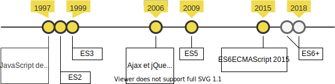

# JavaScript 

Apprendre les bases du JavaScript, un langage de programmation considéré comme l'un des trois piliers du web.

## Qu'est-ce JavaScript?

Selon [@MDN:](https://developer.mozilla.org/fr/docs/Web/JavaScript)

> JavaScript (« JS ») est un langage de script léger, orienté objet. Le code JavaScript est **interprété ou compilé à la volée**. C'est un langage à **objets** utilisant le concept de **prototype**, disposant d'un **typage faible** et **dynamique**.

---

## JavaScript évolue



Dans ce cours les exemples utiliseront la spécification ES6 supporté par les navigateurs récents.

---

## Comment suivre ce cours?

Prérequis:

* Un éditeur de texte (Visual Studio Code, Notepad++, etc..)
* Un navigateur (Firefox, Chrome, Edge)

---

Pour exécuter du javascript, il est possible de tout mettre dans un seul fichier:

`./index.html`:

```html
<!doctype html>
<html lang="en">
<head>
    <meta charset="utf-8">
    <title>Javascript</title>
</head>
<body>
    <script>
        console.log('Hello World!');
    </script>
</body>
</html>
```

---

Ou d'inclure un fichier externe:

`./index.html`:

```html
<!doctype html>
<html lang="en">
<head>
    <meta charset="utf-8">
    <title>Javascript</title>
</head>
<body>
    <script src="script.js"></script>
</body>
</html>
```

`./script.js`:

```js
console.log('Hello World!');
```

---

## Debug

Les instructions telles que `console.log('blabla')` ou `console.error('blabla')` sont visibles dans la console du navigateur (<kbd>F12</kbd>).

---

## Déclarations de variables

Il y a plusieurs façons de déclarer des variables.

```js
// ES5
name = "Rincevent"; // équivaut à var name = "Rincevent";
var age = 35;

// Seulement valable en ES6
const vat = 7.8;
let price = null;
```

Les variables déclarées à l'aide de `var` et `let` sont dynamiques: leurs valeurs peuvent changer. Les variables déclarées avec avec `const` ne peuvent être affectées qu'une fois. Ce sont des **constantes**.

---

## Les primitives

JavaScript compte 6 types de données.

```js
let aString = "JavaScript";
let aNumber = 3.14; // pas d'entiers 
let aBoolean = true;
let nullValue = null;
let undefinedValue;
let aSymbol = Symbol("foo"); // ES6
```

L'instruction `typeof` révèle le type de la variable:

```js
console.log(typeof aBoolean); // "boolean"
```

*Voir: js-01_variables.html*

---

## Les opérateurs de comparaison

L'opérateur `==` compare si les valeurs sont égales tandis que l'opérateur `===` compare si les valeurs et le type (comparaison stricte) sont égaux. Cela vaut aussi pour `!=` et `!==` (pas égal et strictement pas égal).

```js
console.log(2.3 == "2.3"); // true
console.log(2.3 === "2.3"); // false
let aNumber = 2.3;
console.log(2.3 === aNumber); // true
```

Les autres opérateurs de comparaison sont `>`, `<`, `>=` et `<=`.

Même si le type entier n'existe pas, on peut vérifier si un nombre est un entier:
```js
console.log(Number.isInteger(aNumber)); // false
console.log(typeof 4); // "number"
console.log(Number.isInteger(4)); // true
```

---

## Les faux amis!

**Attention!** 

Certaines valeurs sont évaluées en tant que false: `0`, `""`, `null`, `undefined`, `NaN`, et bien entendu `false`.

```js
console.log(false == []); // true
console.log(0 == []); // true
console.log(false == 0); // true

// mais
console.log(false === []); // false
```

*Voir: js-02_operateurs.html*

---

## Les opérateurs arithmétiques

En plus des opérations arithmétiques standards `+`, `-`, `*` et `/`, JavaScript fournit d'autres opérateurs:

| Opérateur           | Description                                    |
| --------------------| -----------------------------------------------|
| Incrément `++`      | Ajoute 1 (*ne pas utiliser*)                   |
| Décrément `--`      | Soustrait 1 (*ne pas utiliser*)                |
| Reste `%`           | Renvoie le reste entier de la division         |
| Exponentiation `**` | Calcule un nombre élevé à une puissance donnée |

*Voir: js-03_math.html*

---

## Contrôle de flux if...else

L'instruction if exécute une instruction si une condition donnée est vraie ou équivalente à vrai. Si la condition n'est pas vérifiée, il est possible d'utiliser une autre instruction.

```js
let temperature = -10;
if (temperature > 5) {
  console.log('Ok');
} else {
  console.log('Risque de gel!');
}
```

Dans un if, on peut combiner plusieurs conditions avec `&&` qui signifie `et` et `||` pour `ou`
```js
let temperature = 6;
if (temperature > 5 && temperature < 10) {
  console.log('Pas de risque de gel mais il fait frisquet.');
} else if (temperature > 57 || temperature < -90) {
  console.log('La sonde est probablement cassée');
}
```

*Voir: js-04_if.html*

---

## Les objets

JavaScript est un langage à objets. Si nous voulons représenter une voiture, par exemple, elle aurait des **propriétés** telles que sa couleur ou sa marque. Créons un objet et stockons-le dans une variable:

```js
let car = {
  brand: "Reliant",
  model: "Regal",
  year: 1962
};
```

Les objets sont **dynamiques**, leur structure n'est pas figée. Ajoutons deux propriétés:

```js
car.color = "Yellow";
car["weightKg"] = 445;
```

On peut également supprimer une propriété:

```js
delete car.year;
```

---

## Les tableaux sont des objets

Les tableaux sont des objets dont les clés (noms des propriétés) sont numériques.

```js
let niceCities = ["Neuchâtel", "Fribourg", "Bern"];

console.log(typeof niceCities); // "object"
console.log(niceCities[0]); // "Neuchâtel"
```

Pour ajouter un élément à un tableau:
```js
niceCities.push("Yverdon");
```

Pour supprimer le dernier élément d'un tableau:
```js
niceCities.pop();
```

Pour extraire une partie du tableau:
```js
veryNiceCities = niceCities.splice(0,2);
```

---

## Boucles

Nous souhaitons ajouter le pays à la liste des villes:

```js
let cities = ["Neuchâtel", "Fribourg", "Bern"];

cities[0] += ", Suisse";
console.log(`La ville ${cities[0]} est à la position 1 dans le tableau`);

cities[1] += ", Suisse";
console.log(`La ville ${cities[1]} est à la position 2 dans le tableau`);

cities[2] += ", Suisse";
console.log(`La ville ${cities[2]} est à la position 3 dans le tableau`);
```

Ce n'est pas très optimal, le code se répète! En programmation on applique un concept nommé DRY:

**Don't Repeat Yourself**.

---

## Boucle while

La boucle `while` s'exécute tant qu'une condition est vraie. Sa syntaxe est la suivante:

```
while (condition_est_vraie) {
  Exécute ce qui est entre les acollades;
}
```

On l'utilise quand on ne connaît pas la longueur d'un tableau. Imaginez dans l'exemple qu'au lieu des trois villes, il y ait toutes les villes de Suisse:

```js
let cities = ["Neuchâtel", "Fribourg", "Bern"];
let cityPosition = 0;

while (cityPosition < cities.length) { // tant que cityPosition et plus petit que 3
  cities[cityPosition] += ", Suisse";
  console.log(`La ville ${cities[cityPosition]} est à la position ${cityPosition} dans le tableau`);
  cityPosition += 1; // on rajoute 1 à cityPosition pour passer à la boucle suivante
}
```

---

## Boucle for

La boucle `for` s'utilise lorsqu'on connaît le nombre de fois que l'on veut exécuter la boucle. Sa syntaxe est la suivante:

```
for (initialisation; condition; expression_finale) {
  Exécute ce qui est entre les acollades;
}
```

Voici un exemple où l'on sait que l'on veut un tableau des trois meilleures villes.

```js
let cities = ["Neuchâtel", "Fribourg", "Bern", "Yverdon", "Moudon", "Lausanne", "Payerne"];
let topCities = [];

for (let i = 0; i < 3; i++) {
  topCities.push(cities[i]);
  console.log(`La ville ${cities[i]} a été ajoutée au tableau des meilleures villes.`);
}

console.log('Le tableau topCities:', topCities);
```

---

## Autres types d'itérations

Il existe d'autres formes de boucles. Vous en trouverez leur définition ici, sous la rubrique `Itérations`:

[https://developer.mozilla.org/fr/docs/Web/JavaScript/Reference/Instructions]https://developer.mozilla.org/fr/docs/Web/JavaScript/Reference/Instructions

Les boucles `while` et `for` suffiront pour l'ensemble des exercices de ce cours.

---

## Fonctions

---

## DOM

---

## jQuery

---