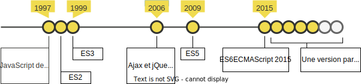
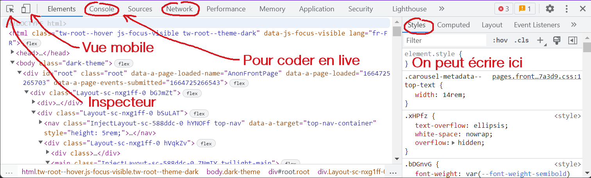
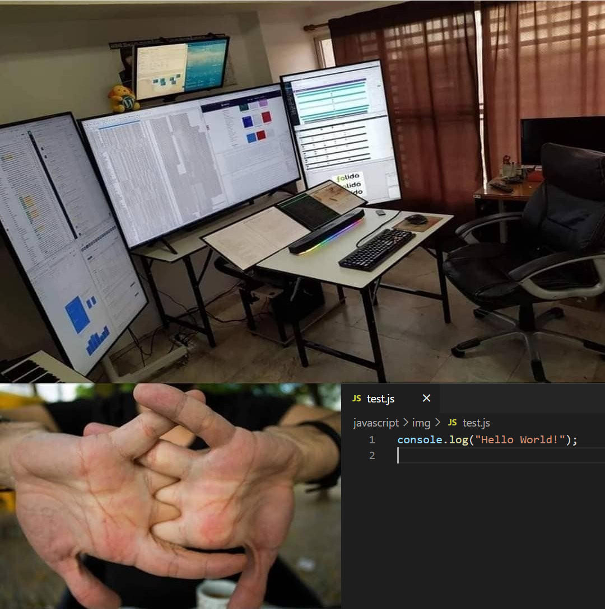

class: center middle

# JavaScript 

Apprendre les bases du JavaScript, un langage de programmation considéré comme l'un des trois piliers du web.

---

Un site web sans JavaScript:

.center[]

Selon [@MDN:](https://developer.mozilla.org/fr/docs/Web/JavaScript)

> JavaScript (« JS ») est un langage de script léger, orienté objet. Le code JavaScript est **interprété ou compilé à la volée**. C'est un langage à **objets** disposant d'un **typage faible** et **dynamique**.

---

## JavaScript évolue



En cas de doute si l'on peut utiliser une fonctionnalité ou pas:

[https://caniuse.com/](https://caniuse.com/)

---

## JavaScript - où placer son code?

Pour exécuter du JavaScript, il est possible de tout mettre dans un seul fichier:

`./index.html`:

```html
<!doctype html>
<html lang="en">
<head>
  <meta charset="utf-8">
  <title>JavaScript</title>
</head>
<body>
  <!-- En général, juste avant la fermeture de body -->
  <script>
    console.log('Hello World!');
  </script>
</body>
</html>
```

---

Ou d'inclure un fichier externe:

`./index.html`:

```html
<!doctype html>
<html lang="en">
<head>
  <meta charset="utf-8">
  <title>JavaScript</title>
</head>
<body>
  <!-- En général, juste avant la fermeture de body -->
  <script src="script.js"></script>
</body>
</html>
```

`./script.js`:

```js
console.log('Hello World!');
```

---

## Debug

Les instructions telles que `console.log('blabla')` ou `console.error('blabla')` sont visibles dans la console du navigateur (<kbd>F12</kbd>).



---

## Déclarations de variables

Il y a plusieurs façons de déclarer des variables.

```js
// Avant 2015
name = "Rincevent"; // équivaut à var name = "Rincevent";
var age = 35;

// Maintenant
const vat = 7.8;
let price = null;
```

Les variables déclarées avec `var` et `let` sont dynamiques: leurs valeurs peuvent changer. Les variables déclarées avec `const` ne peuvent être affectées qu'une fois. Ce sont des **constantes**.

💡 De manière générale, `let` et `const` sont recommandés pour déclarer les variables dans ce cours.

---

## Les primitives

JavaScript compte 7 types de données de base (primitives).

```js
const aString = "JavaScript"; // string
const aNumber = 3.14; // number avec une limite
const aBigInt = BigInt(Number.MAX_SAFE_INTEGER) + 2n; // bigint, entiers sans limites
const aBoolean = true; // boolean
const nullValue = null; // null
const undefinedValue; // undefined
const aSymbol = Symbol("foo"); // symbol, pas utile dans ce cours
```

L'instruction `typeof` révèle le type de la variable:

```js
console.log(typeof aBoolean); // "boolean"
```

---

## Syntaxe des chaînes de caractères

En JavaScript, il y a 3 façons d'écrire des chaînes de caractères:

```js
// Entre apostrophes ou "quote" en anglais.
// Si vous avez besoin d'une apostrophe dans la châine finale, il faut l'échapper
let strQuote = 'I\'m a ' + 'string.';

// Entre guillemets ou "double quotes" en anglais.
// Si vous avez besoin d'un guillemet, il faut l'échapper.
let strDouble = "This is a \"double quoted\" " + "string.";

// Entre "backticks" où il n'y a plus besoin d'utiliser "+" pour concaténer.
// On peut directement y utiliser des expressions qui seront évaluées avant d'être concaténées.
let result = 5;
let strTemplate = `This string has ${result} words`;

```

Le caractère <kbd>&#96;</kbd> est en fait l'accent grave d'un clavier QWERTZ. Pour l'écrire:

<kbd>Maj</kbd> + <kbd>&#96;</kbd> suivi d'un espace.

*Voir: [js-01_variables.html](exemples/js-01_variables.html)*

---

## Les opérateurs de comparaison

L'opérateur `==` compare si les valeurs sont égales alors que l'opérateur `===` compare si les valeurs et le type (comparaison stricte) sont égaux. Cela vaut également pour `!=` et `!==` (pas égal et strictement pas égal).

```js
console.log(2.3 == "2.3"); // true
console.log(2.3 === "2.3"); // false
let aNumber = 2.3;
console.log(2.3 === aNumber); // true
```

Les autres opérateurs de comparaison sont `>`, `<`, `>=` et `<=`.

Même si le type entier n'existe pas en tant que type distinct, on peut vérifier si un nombre est un entier:
```js
console.log(Number.isInteger(aNumber)); // false
console.log(typeof 4); // "number"
console.log(Number.isInteger(4)); // true
```

---

## Les faux amis!

⚠️ **Attention!** ⚠️

Certaines valeurs sont évaluées en tant que false: `0`, `""`, `[]`, `null`, `undefined`, `NaN`, et bien entendu `false`.

```js
console.log(false == []); // true
console.log(0 == []); // true
console.log(false == 0); // true

// mais
console.log(false === []); // false
```

*Voir: [js-02_operateurs.html](exemples/js-02_operateurs.html)*

---

## Les opérateurs arithmétiques

En plus des opérations arithmétiques standards `+`, `-`, `*` et `/`, JavaScript fournit d'autres opérateurs:

| Opérateur           | Description                                    |
| --------------------| -----------------------------------------------|
| Incrément `++`      | Ajoute 1 (*ne pas utiliser*)                   |
| Décrément `--`      | Soustrait 1 (*ne pas utiliser*)                |
| Reste `%`           | Renvoie le reste entier de la division         |
| Exponentiation `**` | Calcule un nombre élevé à une puissance donnée |

*Voir: [js-03_math.html](exemples/js-03_math.html)*

---

## if...else

L'instruction `if` exécute une instruction si une condition donnée est vraie ou équivalente à vrai. Si la condition n'est pas vérifiée, il est possible d'utiliser une autre instruction.

```js
let temperature = -10;
if (temperature > 5) {
  console.log('Ok');
} else {
  console.log('Risque de gel!');
}
```

Dans un if, on peut combiner plusieurs conditions avec `&&` qui signifie `et` et `||` pour `ou`
```js
let temperature = 6;
if (temperature > 5 && temperature < 10) {
  console.log('Pas de risque de gel mais il fait frisquet.');
} else if (temperature > 57 || temperature < -90) {
  console.log('La sonde est probablement cassée');
}
```

*Voir: [js-04_if.html](exemples/js-04_if.html)*

---

## Les objets

JavaScript est un langage à objets. Si nous voulons représenter une voiture, par exemple, elle aurait des **propriétés** telles que sa couleur ou sa marque. Créons un objet et stockons-le dans une variable:

```js
let car = {
  brand: "Reliant",
  model: "Regal",
  year: 1962
};
```

Les objets sont **dynamiques**, leur structure n'est pas figée. Ajoutons deux propriétés:

```js
car.color = "Yellow";
car["weightKg"] = 445;
```

On peut également supprimer une propriété:

```js
delete car.year;
```

*Voir: [js-05_objets](exemples/js-05_objets.html)*

---

## Les tableaux sont des objets

Les tableaux sont des objets dont les clés (noms des propriétés) sont numériques.

```js
let niceCities = ["Neuchâtel", "Fribourg", "Bern"];

console.log(typeof niceCities); // "object"
console.log(niceCities[0]); // "Neuchâtel"
```

Pour ajouter un élément à un tableau:
```js
niceCities.push("Yverdon");
```

Pour supprimer le dernier élément d'un tableau:
```js
niceCities.pop();
```

Pour extraire une partie du tableau:
```js
veryNiceCities = niceCities.splice(0,2);
```

---

## Boucles

Nous souhaitons ajouter le pays à la liste des villes:

```js
let cities = ["Neuchâtel", "Fribourg", "Bern"];

cities[0] += ", Suisse";
console.log(`La ville ${cities[0]} est à la position 1 dans le tableau`);

cities[1] += ", Suisse";
console.log(`La ville ${cities[1]} est à la position 2 dans le tableau`);

cities[2] += ", Suisse";
console.log(`La ville ${cities[2]} est à la position 3 dans le tableau`);
```

Ce n'est pas très optimal, le code se répète! En programmation on applique un concept nommé DRY:

**Don't Repeat Yourself**.

---

## Boucle while

La boucle `while` s'exécute tant qu'une condition est vraie. Sa syntaxe est la suivante:

```
while (condition_est_vraie) {
  Exécute ce qui est entre les acollades;
}
```

On l'utilise lorsqu'on ne connaît pas la longueur d'un tableau. Imaginez dans l'exemple qu'au lieu des trois villes, il y ait toutes les villes de Suisse:

```js
let cities = ["Neuchâtel", "Fribourg", "Bern"];
let cityPosition = 0;

while (cityPosition < cities.length) { // tant que cityPosition et plus petit que 3
  cities[cityPosition] += ", Suisse";
  console.log(`La ville ${cities[cityPosition]} est à la position ${cityPosition} dans le tableau`);
  cityPosition += 1; // on rajoute 1 à cityPosition pour passer à la boucle suivante
}
```

*Voir: [js-06_while.html](exemples/js-06_while.html)*

---

## Boucle for

La boucle `for` s'utilise lorsqu'on connaît le nombre de fois que l'on veut exécuter la boucle. Sa syntaxe est la suivante:

```
for (initialisation; condition; expression_finale) {
  Exécute ce qui est entre les acollades;
}
```

Voici un exemple où l'on sait que l'on veut un tableau des trois meilleures villes.

```js
let cities = ["Neuchâtel", "Fribourg", "Bern", "Yverdon", "Moudon", "Lausanne", "Payerne"];
let topCities = [];

for (let i = 0; i < 3; i += 1) {
  topCities.push(cities[i]);
  console.log(`La ville ${cities[i]} a été ajoutée au tableau des meilleures villes.`);
}

console.log('Le tableau topCities:', topCities);
```

*Voir: [js-07_for.html](exemples/js-07_for.html)*

---

## Autres types d'itérations

Il existe d'autres formes de boucles. Vous en trouverez leur définition ici, sous la rubrique `Itérations`:

[https://developer.mozilla.org/fr/docs/Web/JavaScript/Reference/Instructions](https://developer.mozilla.org/fr/docs/Web/JavaScript/Reference/Instructions)

Les boucles `while` et `for` suffiront pour l'ensemble des exercices de ce cours.

---

## Fonctions

Les fonctions servent à stocker une logique et à y faire appel quand on en a besoin en évitant des répétitions de code (**DRY**):

```js
function doSomething() {
    console.log("It's done!");
}
doSomething();
```

*Voir: [js-08_fonctions_1.html](exemples/js-08_fonctions_1.html)*

---

On peut stocker une fonction dans une variable. 

Les fonctions peuvent renvoyer une valeur avec le mot clé `return`:

```js
let addNumbers = function(num1, num2) { // la fonction s'attend à recevoir deux arguments num1 et num2
    return num1 + num2;
}

console.log(typeof addNumbers); //function

let result = addNumbers(10, 20);

console.log(`${result} est de type ${typeof result}`); // 30 est de type number
```

---

On peut également stocker des fonctions dans un objet.

Souvenez-vous de notre objet voiture créé précédemment. Ajoutons-lui une fonction:

```js
let car = {
  brand: "Reliant",
  model: "Regal",
  year: 1962,
  start: function () {
      return "VROOOM!";
  }
};

console.log("Car will start:", car.start());
```

*Voir: [js-09_fonctions_2.html](exemples/js-09_fonctions_2.html)*

---

## Portée (scope) de `var` <a name="var-scope"></a>

Les variables déclarés avec `var` dans une fonction sont utilisables / modifiables dans toute la fonction:

```js
function showCities(cities) {
  var numberOfCities = cities.length;

  for (var i = 0; i < numberOfCities; i += 1) { // i est définie dans le bloc for
    var city = cities[i]; // city est définie dans le bloc for
    console.log(city);
  }

  console.log(`Il y a ${numberOfCities} villes.`);
  console.log(`La dernière ville est ${city} et le compteur est à ${i}.`); // on accède aux deux variables ici
}

showCities(["Neuchâtel", "Fribourg", "Bern"]);
console.log(`Il y a ${numberOfCities} villes.`); // erreur

// Neuchâtel
// Fribourg
// Bern
// Il y a 3 villes.
// La dernière ville est Bern et le compteur est à 3.
// ReferenceError: numberOfCities is not defined
```

---

## Portée (scope) de `let` ou `const`

Les variables déclarés avec `let` et `const` ont une portée de bloc

```js
function showCities(cities) {
  const numberOfCities = cities.length;

  for (let i = 0; i < numberOfCities; i += 1) { // i est définie dans le bloc for
    let city = cities[i]; // city est définie dans le bloc for
    console.log(city);
  }

  console.log(`Il y a ${numberOfCities} villes.`);
  console.log(`La dernière ville est ${city} et le compteur est à ${i}.`); // erreur
}

showCities(["Neuchâtel", "Fribourg", "Bern"]);

// Neuchâtel
// Fribourg
// Bern
// Il y a 3 villes.
// ReferenceError: city is not defined
```

---

## Portée (scope) globale

Les variables déclarés avec `var` en dehors d'une fonction, ont une portée globale.

```js
var city = "Bern";

function showCity() {
  console.log(`Vous êtes à ${city}.`); // city est accessible
  city = "Lausanne"; // city est réaffectable
}

showCity();
showCity();

// Vous êtes à Bern.
// Vous êtes à Lausanne.
```
---

Il est fortement recommandé de ne pas utiliser `var` si vous le pouvez. La seule raison valable d'utiliser `var` est la création de votre propre librairie ce qui sort du cadre de ce cours.

Utilisez `let` et `const`:

```js
let city = "Bern";

function showCity() {
  console.log(`Vous êtes à ${city}.`); // erreur
}
```

*Voir: [js-10_scope.html](exemples/js-10_scope.html)*

---

## Exercices

.center[]

