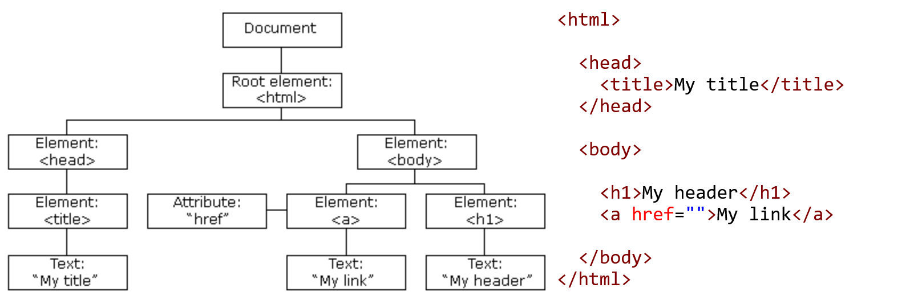
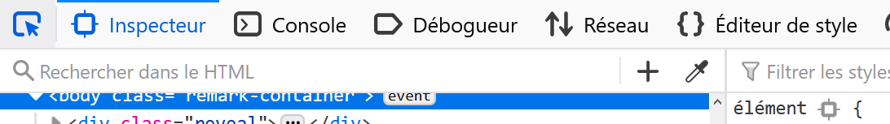
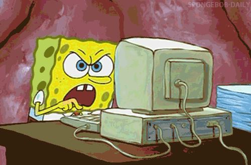

## JavaScript 2<sup>ème</sup> partie

Toujours selon [@MDN:](https://developer.mozilla.org/fr/docs/Web/JavaScript)

> JavaScript (« JS ») est un langage de script léger, orienté objet. Le code JavaScript est **interprété ou compilé à la volée**. C'est un langage à **objets** disposant d'un **typage faible** et **dynamique**.

## Document Object Model (DOM)

Le DOM est une interface de programmation (API) pour l'HTML, le XML et le SVG. Dans le cadre de ce cours, le DOM sert à connecter une page web au JavaScript.

Même si le DOM est essentiellement utilisé en JavaScript, ce n'est pas du JavaScript.

---
Le DOM:

* fournit une représentation structurée d'un **document** en arbre
* expose des méthodes permettant d'accéder au document et d'y apporter des modifications dans sa **structure**, son **style** et son **contenu**.
* représente le document en **noeuds** et **objets** ayant chacuns leurs propriétés
* Permet d'écouter et de gérer des **événements** sur les noeuds.

.center[]

*Voir dom-01_document.html*

---

## Gestion d'événements

Une page HTML se charge -> le `document` se créé. Comment savoir quand la page a terminé de se charger?

```js
// Création d'un objet qui a deux propriétés de type string
const myContent = {
  alertText: "Le document est chargé",
  alertLink: "https://developer.mozilla.org/fr/docs/Web/API"
};

// Utilisation du DOM!
document.onreadystatechange = function() {
  console.log("L'état du document a changé:", document.readyState);
  if (document.readyState === "complete") {
    console.log(myContent.alertText);
  }
}
```

*Voir dom-01_document.html*

---

## Quelques autres événements

| Nom         | Code exemple                                                                | Test                                                                   |
| ------------| ----------------------------------------------------------------------------| -----------------------------------------------------------------------|
| onclick     | `<button onclick="console.log('click')">Cliquez-moi!</button>`              |<button onclick="console.log('click')">Cliquez-moi!</button>            |
| onchange    | `<input type="checkbox" value="vrai" onchange="console.log('change!')">`    |<input type="checkbox" value="vrai" onchange="console.log('change!')">  |
| onmouseover | `<div class="pink" onmouseover="console.log('onmouseover!')">`              |<div class="pink" onmouseover="console.log('onmouseover!')">            |
| onselect    | `<input type="text" onselect="console.log('select!')" value="Select me!">`  |<input type="text" onselect="console.log('select!')" value="Select me!">|
| onkeyup     | `<input type="text" onkeyup="console.log(this.value)">`                     |<input type="text" onkeyup="console.log(this.value)">                   |

Plein d'autres événements existent:
https://developer.mozilla.org/fr/docs/Web/Events

*Voir dom-02_ready.js*

---

## Modification du DOM

Les exemples précédents se contentaient d'écouter le DOM et d'afficher des messages dans la console. On peut faire mieux, on directement modifier le DOM:

```js
document.getElementById("modification-du-dom").textContent="Le titre de cette page s'est modifié!";
```

* `getElementById` est une méthode de `Document` qui retourne un `Element`.
* `textContent` est un propriété de `Node` héritée par `Element`.

La console ou certains éditeurs de code proposent de l'autocomplétion de méthodes et propriétés de DOM.

Pour naviguer dans le DOM, rien de mieux l'**outil de sélection d'éléments** dans les outils de développement du navigateur!




*Voir dom-03_ready_alert.js*

---

## Le mot-clé `this` dans l'HTML

En JavaScript, `this` se réfère au contexte dans lequel on se trouve. [Voir le chapitre sur la portée des variables](../javascript1#25)

Utilisé comme argument dans le *callback* d'un *event*, il permet de passer l'élément actuel au *callback*:

Dans cet HTML, `doSomething()` est la fonction appelée quand `onkeyup` est fait. Autrement dit, `doSoemthing()` est le *callback* de `onkeyup`:
```html
<input type="text" onkeyup="doSomething(this)">
```

En JavaScript
```js
function doSomething(someElement) {
  console.log(typeof someElement); // object
  console.log(someElement.value); // le contenu que l'utilisateur tape dans l'input
}
```

Le mot clé `this` peut également être utilisé dans une fonction JavaScript mais cela sort du contexte de ce cours. Si vous souhaitez en savoir plus:

https://www.w3schools.com/js/js_this.asp

---

## Exercices

Faites les exercices dom-01 à dom-04.


---

## jQuery

jQuery est une librairie JavaScript qui facilite les intéractions avec le DOM et apporte d'autres fonctionnalités utiles dont nous parlerons plus tard.

Pour inclure une librairie dans un projet, on peut utiliser un CDN (*Content Delivery Network*). Un **CDN** est un réseau de serveurs internet hébergeant des librairies JavaScript, des CSS ou des polices. Les CDN sont fiables et disposent d'une haute disponibilité:

```html
<body>
...
<script src="https://code.jquery.com/jquery-3.5.1.min.js"
        integrity="sha256-9/aliU8dGd2tb6OSsuzixeV4y/faTqgFtohetphbbj0="
        crossorigin="anonymous"></script>
</body>
```

---

Vous pouvez également [télécharger ici](https://jquery.com/download/) la dernière version de jQuery et l'inclure comme n'importe quel autre script JavaScript:

```html
<body>
...
<script src="js/jquery-3.5.1.min.js"></script>
</body>
```

Créez ensuite un fichier `script.js` et chargez-le **après** jQuery. Copiez-collez cette ligne dans votre fichier `script.js`

```js
console.log($("body")); // Object
```

*Voir jq-01_load_jquery.html*

---

## Pourquoi mettre les `<script>` juste avant la fin du `<body>`?

C'est une bonne pratique de charger les fichiers JavaScript à la fin de la page HTML:
* Le navigateur parcourt les fichiers JavaScript quand il les charge. Pendant qu'il fait ça, il ne fait rien d'autre. Sur de grands projets, la page web peut donner des impressions de lenteur.
* Avec le script en fin de page, pratiquement tout le DOM est prêt à être utilisé par le votre script, il n'y a donc pas besoin d'attendre des événements `document.readyState`

L'ordre des `<script>` est important! Si vous faites un script dans lequel vous utilisez jQuery par exemple, alors votre script devra être chargé **après** jQuery

```html
<body>
...
<script src="js/jquery-3.5.1.min.js"></script>
<script src="js/script.js"></script>
</body>
```

---

## Très bien, mais jQuery c'est quoi?


jQuery est une librairie JavaScript créée en 2006 facilitant la manipulation du DOM. Elle facilite également les appels asynchrones à des ressources web (ajax), nous verrons cela plus tard.

jQuery est la librairie JavaScript la plus utilisée pour du développement web. Aujourd'hui, il est possible de s'en passer en utilisant des frameworks (collections de librairies) tels que Angular ou Vue mais les principes de jQuery restent les mêmes dans ces frameworks.

La documentation est très riche avec plusieurs exemples pour chaque fonctionnalité. [N'hésitez pas à la consulter!](https://api.jquery.com/)

---

## Comment utiliser jQuery?

La plupart des librairies exposent une variable globale comme point d'entrée pour son utilisation. Dans le cadre de jQuery c'est `$`.

### Sélectionner dans le DOM

C'est le but premier de jQuery: pour sélectionner dans le DOM on utilise la syntaxe `$(...)` en remplaçant les `...` par un [**sélecteur CSS**](https://www.w3schools.com/cssref/css_selectors.asp)!

| Exemples      | Signification                                                        |
| --------------| ---------------------------------------------------------------------|
| `$("p")`      | Sélectionne tout les éléments `<p>`                                  |
| `$(".test")`  | Sélectionne tout les éléments qui ont une classe test `class="test"` |
| `$("#test")`  | Sélectionne l'élément qui a un id test `id="test"`                   |

*Voir https://www.w3schools.com/jquery/trysel.asp*

---

### Modifier le DOM

Une fois qu'on sait sélectionner des éléments, on va vouloir en faire quelque chose. Pour modifier le DOM la syntaxe est `$("sélecteur css").action()` en remplaçant `action()` par une méthode jQuery.

| Exemples                                | Signification                                                             |
| ----------------------------------------| --------------------------------------------------------------------------|
| `$("p").hide()`                         | Fait disparaître tous les éléments `<p>`                                  |
| `$(".test").show()`                     | Fait apparaître tout les éléments qui ont une classe test `class="test"`  |
| `$("#test").addClass('pink')`            | Ajoute une classe pink à l'élément qui a un id test `id="test"`           |
| `$("h1.principal").append("Du texte");` | Ajoute `Du Texte` à un élément `<h1 class="principal"></h1>`              |

Une liste exhaustive des actions possibles dans jQuery n'aurait pas de sens. Je vous invite à consulter ces exemples:

https://www.w3schools.com/jquery/jquery_examples.asp

*Voir jq-02_actions.html*

---

## Exercices

Parcourez les exemples préfixés `jq-` et faites l'exercice jq-chat.

.center[]
