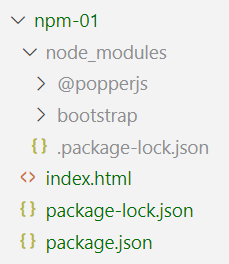
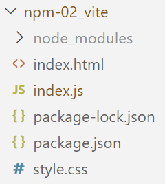

## npm

.center[]

npm est un gestionnaire de paquets. Il facilite l'installation et la gestion des librairies dont dépend notre projet. Il est courant qu'un projet en JavaScript dépende de plusieurs librairies qui elles-mêmes ont des dépendances résultant parfois sur des milliers de dépendances.

npm s'utilise en tapant `npm` en ligne de commande mais:

* Node.js doit être installé sur la machine
* npm doit être présent dans le `Path` (c'est une question posée à l'installation)

---

### npm init

Pour démarrer un projet avec npm que ce soit dans un répertoire vide ou dans lequel du code est déjà présent, lancez cette commande à la racine de votre projet:

> ℹ️ Si la fenêtre de terminal n'est pas encore affichée dans votre Visual Studio Code: cliquez sur le menu *Terminal* > *New Terminal*

```shell
npm init -y
```

L'option `-y` permet de répondre à toutes les questions par oui.

Un fichier package.json est créé:

* Il contient toutes les infos nécessaires à publier notre projet en tant que `package`.
* Les dépendances à d'autres librairies y seront listées.

---

### npm install

L'instruction `install` que l'on peut abréger en `i` permet d'installer un paquet.

```sh
npm i bootstrap@5.3.2 @popperjs/core
```

> ℹ️ Il est recommandé de spécifier une version, ici `@5.3.2`. Cela afin d'éviter des mises à jours automatiques pouvant casser
votre projet.

<table>
<tr>
  <td>
Le fichier <code>package.json</code> a été modifié: une section <code>depedencies</code> s'est créée<br><br>
Un fichier <code>package-lock.json</code> est arrivé: il contient l'arbre des dépendances<br><br>
Un dossier <code>node_modules</code> s'est créé: il contient les fichiers téléchargés prêts à être utilisés, dans ce cas: bootsrap et popperjs<br><br>
  </td>
  <td>
    
  </td>
</tr>
</table>

---

### npm install --save-dev

L'option `--save-dev` ou `-D` permet d'installer des dépendances pour le développement.

On parle d'outils qui vont nous aider pour le développement mais qui ne seront pas dans le code final en production quand l'application JavaScript sera terminée.

---

### Vite

.center[]

Vite permet d'utiliser des fonctions JavaScript qui ne sont pas encore supportées par les navigateurs. Vite se chargera de transformer (transpiler) notre code vers un code compréhensible par le navigateur. Il va également réduire la taille du code par deux mécanismes principaux:

* La minification: tous les espaces blancs sont réduits à leur strict minimum et les variables et fonctions sont renommées quand cela est possible
* Seules les parties des librairies qui sont utilisées dans notre code seront importées dans le fichier final.

Pour installer Vite:

```sh
npm i -D vite
```

---

### Vite - configuration

Dans le fichier `package.json`, remplacer les lignes `"scripts"`

```json
  "scripts": {
    "test": "echo \"Error: no test specified\" && exit 1"
  },
```

par celles-ci:

```json
  "scripts": {
    "start": "vite",
    "build": "vite build",
    "serve": "vite preview",
  },
```

Ces "scripts" sont des raccourcis de commandes communs à la plupart des projets JavaScript. Ils permettent de lancer les commandes Vite sans avoir à toucher au Path.

---

### Vite - configuration

<table>
  <tr>
    <td>
      <p>La commande <code>npm run start</code> permet de lancer le mini serveur vite qui contrairement au "Go Live" de Visual Studio Code, se chargera de transpiler le code tout en rechargeant le navigateur automatiquement.</p>
      <p>La commande <code>npm run build</code> permet de transpiler le code dans un dossier nommé `dist`. C'est le code final qui sera déployé en production</p>
      <p>La commande <code>npm run serve</code> permet de lancer le mini serveur vite sur le résultat de la transpilation dans le dossier `dist`. On peut ainsi prévisualiser ce qui sera mis en production.</p>
    </td>
    <td>
      
    </td>
  </tr>
</table>

---

### Vite et npm - règles à respecter!

On peut continuer à inclure les CSS et JavaScript avec la méthode traditionnelle mais on ne profitera pas du travail d'optimisation de Vite.

Pour un projet simple:

* Importer les CSS tierces (telles que Bootstrap) dans notre fichier CSS avec l'instruction `@import`
```css
@import "bootstrap";
```
* Créer un fichier `index.js` qui importe la CSS
```js
import './style.css';
```
* Dans `index.html`, le JavaScript est importé avec l'attribut `module`
```html
<script type="module" src="index.js"></script>
```
* Dans `index.html`, on n'a plus d'import de CSS dans le `<head>`
* On n'utilise plus "Go Live" mais `npm run start`

---

background-image: url(img/background.png)
background-size: cover
# OpenLayers 1

---

### Librairies JavaScript de Webmapping

Deux librairies principales pour du webmapping 2D open source:

<table>
  <tr>
    <th style="width:50%">
      
    </th>
    <th style="width:50%">
      
    </th>
  </tr>
  <tr>
    <td>Simple de base mais peut-être étendue par des plugins</td>
    <td>Beaucoup de fonctionnalités de base + plugins</td>
  </tr>
  <tr>
    <td>Grande communauté, beaucoup d'exemples sur le web</td>
    <td>Moins grande communauté mais évolue rapidement</td>
  </tr>
  <tr>
    <td>Projection suisse peu supportée</td>
    <td>Très présente sur le marché Suisse</td>
  </tr>
</table>

D'autres librairies existent:

* Mapbox et MapLibre: plutôt pour des vector tiles
* Cesium: globe 3D
* Here Maps API, Google Maps API: propriétaire
* Carto: styliser des cartes avec CSS

---

## OpenLayers: exemples d'utilisation

* GeoAdmin : [map.geo.admin.ch](https://map.geo.admin.ch)
* SuisseMobile : [map.wanderland.ch](https://map.wanderland.ch)
* Luxembourg : [map.geoportail.lu](https://map.geoportail.lu)
* EPFL : [plan.epfl.ch](https://plan.epfl.ch)
* Transports publics en temps réel : [tracker.geops.ch](https://tracker.geops.ch)
* Saint-Pierre de la Réunion : [https://geo.saintpierre.re](https://geo.saintpierre.re)
* Région de Nyon : [map.cartolacote.ch](https://map.cartolacote.ch)

---

## Première carte!

Suivre le "Quick Start" d'OpenLayers:

https://openlayers.org/doc/quickstart.html

*Voir ol-1_carte_basique*

---

## Comment ça marche?

1. `main.js` est chargé dans une balise `<script>` de `type=module` dans le fichier `index.html`.

2. On crée, dans l'HTML un `<div>` qui contiendra la carte. On lui donne un `id` qui servira de référence à OpenLayers. Ici: `<div id="map">`.

3. Un fichier `style.css` configure la carte afin qu'elle soit en plein écran

4. Dans `main.js` sont importées:
  * La CSS
  * Les parties d'OpenLayers nécessaires à construire notre carte

### API & exemples

https://openlayers.org/

---

## `new` ?

JavaScript n'a pas vraiment de classes, c'est un langage à objets. On peut cependant utiliser le mot-clé `new` sur des fonctions. Les fonctions se comportent comme des classes et créent des instances de la fonction. Ces deux codes sont identiques:

<table class="custom-table">
  <tr>
    <td><pre class="margin-0"><code class="js">function Car() {}

const myCar = new Car();
console.log(myCar instanceof Car); // true
</code></pre>
    </td>
    <td><pre class="margin-0"><code class="js">class Car {}

const myCar = new Car();
console.log(myCar instanceof Car); // true
</code></pre>
    </td>
  </tr>
</table>

## `import` ?

Les exemples d'OpenLayers utilisent [les modules JavaScript](https://developer.mozilla.org/fr/docs/Web/JavaScript/Guide/Modules). Les modules permettent de ne charger qu'une partie précise d'une librairie.

---

## OpenLayers: principes

### Map

C'est l'élément de base. La carte contrôle où elle sera placée dans l'HTML grâce à sa propriété `target`, elle contient une `view` et des `layers` [entre autres](https://openlayers.org/en/latest/apidoc/module-ol_Map-Map.html).

### View

Obligatoire: contient le niveau de `zoom` et le `center` [entre autres](https://openlayers.org/en/latest/apidoc/module-ol_View-View.html). C'est une propriété de Map!


### TileLayer

C'est une couche tuilée (la carte se charge par tuiles). Nous discuterons des autres types de couches et de leurs sources plus tard.

---

## OpenLayers: toute la documentation dans l'API!

En règle générale, dans des librairies complexes, on attribue pas des valeurs directement aux propriétés (exemple `Map.view.zoom = 10`). On passe par des *getters* et *setters*. Exemples de méthodes de la classe `View`:

#### Get:
* Centre : `getCenter()`
* Zoom : `getZoom()`
* Orientation : `getRotation()`
* Projection : `getProjection().getCode()`

#### Set :
* Centre : `setCenter(center)`
  * avec `center` : tableau de coordonnées (ex. `[2600000, 1200000]`)
* Zoom : `setZoom(zoom)`
  * avec `zoom` : entier (ex. `15`)
* Orientation : `setRotation(rotation)`
  * avec `rotation` : angle en radians (`3.14`)

*Voir ol-2_methodes_vue*

---

## Contrôles

Les contrôles sont des éléments permettant de manipuler la carte ou d'afficher une information.

Par défaut, `Map` en charge 3:
* `Zoom`
* Orientation `Rotate` (apparaît dès que la carte est tournée)
* Attribution `Attribution`

De nombreux autres contrôles existent:
* Barre d’échelle : `ScaleLine`
* Carte d'aperçu : `OverviewMap`
* Position curseur : `MousePosition`
* Plein écran : `FullScreen`
* Zoom sur étendue max : `ZoomToExtent`
* Curseur de zoom : `ZoomSlider`


Il est même possible de créer ses propres contrôles!

*Voir ol-3_controles*

---

## Couches

Le nombre possible de types de couches (module `ol/layer`) sont nombreux mais peuvent être divisés en 2 catégories:

* Raster (par ex: `TileLayer`, `ImageLayer`)
* Vectoriel (par ex: `VectorLayer`, `VectorTileLayer`)

Comme dans QGIS, une couche représente un calque, la source de la donné (module `ol/source`) est par conséquent une propriété d'un `layer` et on peut à nouveau les séparer en 2 catégories:

* Raster (par ex: `TileSource`, `ImageSource`)
* Vectoriel (par ex: `VectorSource`, `VectorTile`)

---

## Couches tuilées

Quelques exemples de couches tuilées `ol/layer/Tile` et leurs sources:

* OpenStreetMap : `OSM`
  * Ne pas utiliser cette source en production! Elle est disponible à des fins de démo.
* Bing : `BingMaps`
  * `imagerySet` : *Road*, *Aerial*, *AerialWithLabels*
  * `key` : clé à obtenir sur *bingmapsportal.com*
* Stamen : `Stamen`
  * `layer` : *terrain*, *toner*, *toner-lite*, *watercolor*, *terrain-labels*
* etc.

*Voir ol-4_couches_tuiles*

---

## WMS (*Web Map Service*)

Il y a deux façons de lire du WMS avec OpenLayers:

#### `TileLayer` avec une source `TileWMS`
* OpenLayers découpe l'étendue de la vue en une mosaïque d'imagettes carrées qu'il va demander au serveur
* Performant sur des WMS raster, les imagettes sont mises en cache
* Plus lent lorsque le serveur doit calculer un rendu complexe

#### `ImageLayer` avec une source `ImageWMS`
* OpenLayers demande au serveur WMS une image de la taille de la carte
* Pas de cache, à chaque zoom, une nouvelle image est demandée
* Intéressant quand le rendu d'une couche est complexe

Une source WMS demandra toujours:
* une `url` du service WMS
* les `params` standards WMS, c'est-à-dire les paramètres GetMap tels que `LAYERS`, `FORMAT`, etc.
* si le WMS est soumis à des droits d'utilisation, il faut indiquer les `attributions`

*Voir ol-5_couches_wms*

---

## Exercice

1. Créez un projet openlayers à l'aide du [quickstart](https://openlayers.org/doc/quickstart.html)
2. Installez Bootstrap et importez bootstrap dans votre fichier `style.css`
3. Passez la carte à 400px de hauteur.
4. Ajoutez deux couches supplémentaires à votre carte. Choisissez-les parmis les exemples des couches tuilées présentées en cours. Rendez-les invisibles à l'aide de la propriété `visible` disponible sur un `TileLayer`
5. Crééez un sélecteur de carte avec le style de boutons de votre choix. Ça peut être trois boutons, des boutons radio, etc. Votre sélecteur de carte appelera une fonction qui changera la visibilité d'un layer.
6. Vous apprenez que l'HEIG-VD dispose d'un serveur WMS:
  * lien: `https://ogc.heig-vd.ch/qgis?service=WMS&request=getcapabilities&version=1.3.0`
  * Ajoutez la couche `120307_Yvonand_Plage_25cm` disponible sur ce serveur.
